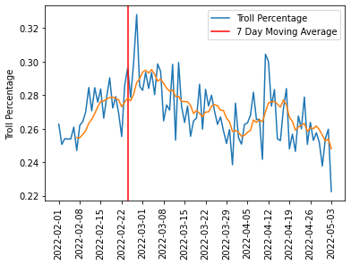

# reddit_troll_analysis2

Woof, after managing to push my old reddit repo (reddit_troll_analysis1), i'm finally taking a more regimented approach to this.

High level process of what we're working on here:
1. Pull All user data from the Trolls/Bots/Bad-Actors (calling these "trolls") from the Reddit API and saving to postgres
2. Pull all user data from non-bot users and save to postgres (i'm not entirely sure of this methodology just yet. the last one had too many users)
3. Train classification model
4. Set up new feed of current reddit posts and classify them as their pulled from the API and save in DB
5. Host results somewhere

I used the saved data from the original analysis I tried in https://github.com/sak0213/reddit_troll_analysis1 because why repull everything. Current DB consists of 11 Tables. Here are the ones that were relevant:
1. Sus_users - Table of troll account names & account info
2. Sus_user_posts - Table of complete post history of trolls "sus users"
3. Sus_user_comments - The above but for comment history
4. Normal_user_seed_posts* - 426k random reddit posts during the time the trolls were active (not including posts from trolls)
5. Norm_users - 56k users featured in the table above
6. Norm_user_posts - The first 100 posts from all users in the table above

*My setup for choosing "non-troll" (aka normal) users seems janky. I used the Pushshift.io api to pull the first 1k posts from the first 126 subreddits featured in the original troll post history (126 subs had more than 5 posts/comments). Collecting "normal" data had me fearing for how much of Reddit i was going to download onto my personal laptop. After getting the 426k posts, i need to choose how many of the users in this  table's account history i'd like to download. I'm not entirely sure why i didnt use this table as my source for non-troll posts, but here's what i did instead:
Since we have about 1k troll names, i figured i'd just select (# of troll names / .01) to produce 100x the amount of non-troll users for analysis. The code i selected ran into a lot of deleted accounts (PRAW), so i ended up with 56k users not in my troll list. From here, i pulled the first 100 posts from each user, as most of my trolls had about 100 posts each.

The process above was so much that i decided to skip comment histories for now..

Using the above data, I trained a random forest model with grid cv for like 43 hours (20k features, woof) before landing on a model with ok accuracy (0.77 f1-score). The dataset used 8771 non-trolls and 8518 trolls to train. I did just notice an issue where my count vectorizer was returning a warning with the Lowercase parameter, so i removed that for now.

After getting my model fitted, I removed a few thousand features with less than .00001 weight and retrained the model with some hyperparamter tuning and ended with the same f1-score, but slightly better recall (loss in precision though). I'll likely take another stab at retraining to get better results.

Added this model to my "user analyzer" file, which pulls summary stats for a users account with a cute chart. Currently pulling comments for "normal" users, then i'll add that to the analyzer and see what it looks like.

Wow, after copying the code i used to pull normal user posts, i just realized how horribly wrong this while loop ran. Thank god for union removing duplicates.
